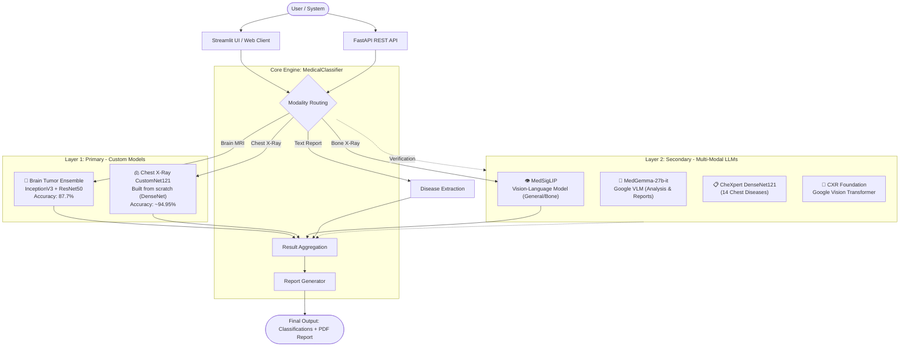
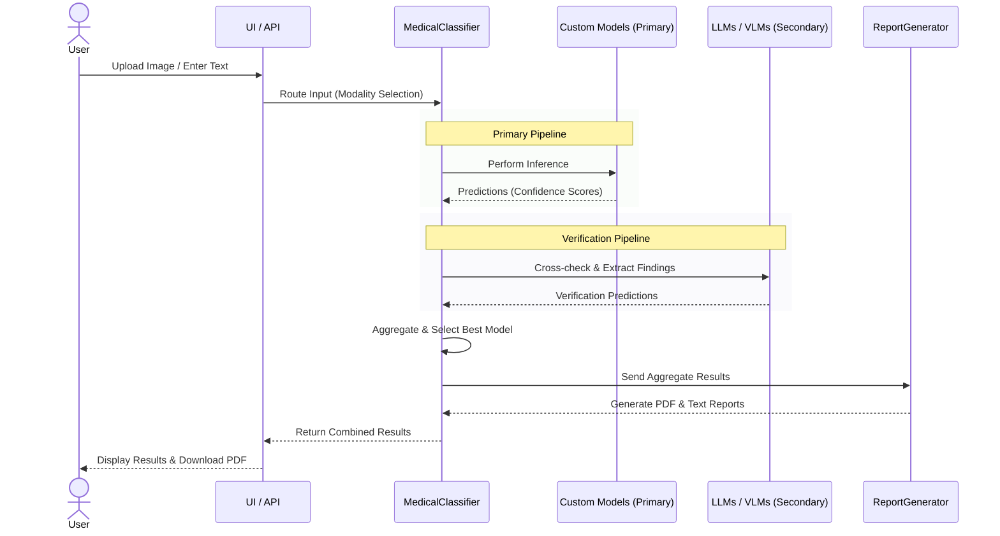

# 🏥 SWAYAMSEM: Self-Validating AI for Medical Semantics

[](https://www.python.org/)
[](https://pytorch.org/)
[](https://fastapi.tiangolo.com/)
[](https://streamlit.io/)

**SWAYAMSEM** is a comprehensive, multi-modal Medical AI classification system that orchestrates multiple state-of-the-art vision and language models for advanced medical image and text report analysis. 

The system implements **modality-specific pipelines** for **Chest X-ray, Bone X-ray, Brain MRI, and Text Reports**, providing automated disease classification, verification, and professional radiology-style report generation.

---

## 🏗️ 1. Deep Architecture Diagram

The system operates on a **Two-Layer Architecture**:
1. **Layer 1 (Primary)**: Custom-trained or built-from-scratch CNN models optimized for specific anatomy.
2. **Layer 2 (Secondary)**: Large Vision-Language Models (VLMs) and LLMs for verification and cross-checking.



---

## 🔄 2. System Flow

The analysis pipeline routes traffic based on input type to ensure model correctness (e.g., excluding chest models for bone analysis).



---

## 📊 3. Performance & Numbers

### 🧠 Brain Tumor Detection
- **Architecture**: Ensemble (InceptionV3 + ResNet50) Custom Transfer Learning.
- **Accuracy**: **87.7%** on test data.
- **Classes**: Glioma, Meningioma, Pituitary, Normal.

### 🫁 Chest X-Ray Diagnosis
- **Architecture**: **CustomNet121** (DenseNet-121 architecture built completely from scratch).
- **Training**: 40 Epochs with learning rate scheduling on ChestX-ray8 dataset.
- **Dataset**: 108,948 frontal-view images.
- **Accuracy**: **~94.95% binary accuracy** on multi-label validation.
- **Classes**: 14 pathology labels (Atelectasis, Cardiomegaly, Pneumonia, etc.).

### 📖 Disease Knowledge Base
- **Knowledge Store**: 16 structured categories.
- **Disease Mapping**: Supports **200+ distinct medical conditions** for text report disease extraction.

---

## 🛠️ 4. Specialized Pipelines

| Modality | Primary Model | Secondary / Verification | Logic / Purpose |
| :--- | :--- | :--- | :--- |
| **Chest X-Ray** | MedGemma | CheXpert, CXR Foundation | Extensive multi-label chest disease detection. |
| **Bone X-Ray** | MedSigLIP | MedGemma-27b | **Fracture-Priority** routing (excludes chest models). |
| **Brain MRI** | Custom Ensemble | MedSigLIP, MedGemma | Fast Custom Inference with LLM fallback & validation. |
| **Text Report** | Disease DB Extract | MedGemma-27b | Semantic extraction + interpretation. |

---

## 💻 5. Installation & Setup

### Prerequisites
- Python 3.10+
- 8GB+ RAM (16GB recommended for LLM loading)
- 10GB+ Disk Space for Model Cache
- Hugging Face Token (required for MedGemma / gated models)

### Quick Setup

1. **Clone the repository**:
   ```bash
   git clone https://github.com/SWAYAMPATEL30/MedAI.git
   cd MedAI
   ```

2. **Install Core Dependencies**:
   ```bash
   pip install -r requirements.txt
   pip install -r requirements_api.txt
   ```

---

## 🚀 6. Usage

### 🖥️ 1. Streamlit Specialized UI (All-in-One Dashboard)
Provides tabs for each modality (Chest, bone, brain, text) with uploaders and PDF generation triggers.
```bash
streamlit run app_specialized.py --server.port 8502
```
🌐 **URL**: `http://localhost:8502`

### 🔌 2. FastAPI Backend REST API
Allows integrations with Next.js, V0, or production mobile clients.
```bash
uvicorn api:app --reload --port 8000
```
🌐 **Docs**: `http://localhost:8000/docs`

#### Key Mainpoints:
- `POST /api/classify/chest` : Analyze Chest X-Ray
- `POST /api/classify/bone` : Analyze Bone X-Ray (Fracture Priority)
- `POST /api/classify/brain` : Analyze Brain MRI
- `POST /api/classify/text` : semantic Text Disease Extraction

---

## 📂 7. File Components

| Component | File | Role |
| :--- | :--- | :--- |
| **Core Logic** | `medical_classifier.py` | Orchestration, aggregation, decision tree logic |
| **API** | `api.py` | FastAPI specifications and middleware |
| **Specialized UI** | `app_specialized.py` | Premium 5-tab user interface dashboard |
| **Reports** | `report_generator.py` | PDF templating (ReportLab) |
| **Disease DB** | `disease_categories.py` | 200+ Disease extraction matrices |

---

## ⚠️ Disclaimer
*This system is intended for **research and educational purposes only**. It does not replace clinical consultation, FDA-certified readers, or real radiological diagnostics in medical practice.*
