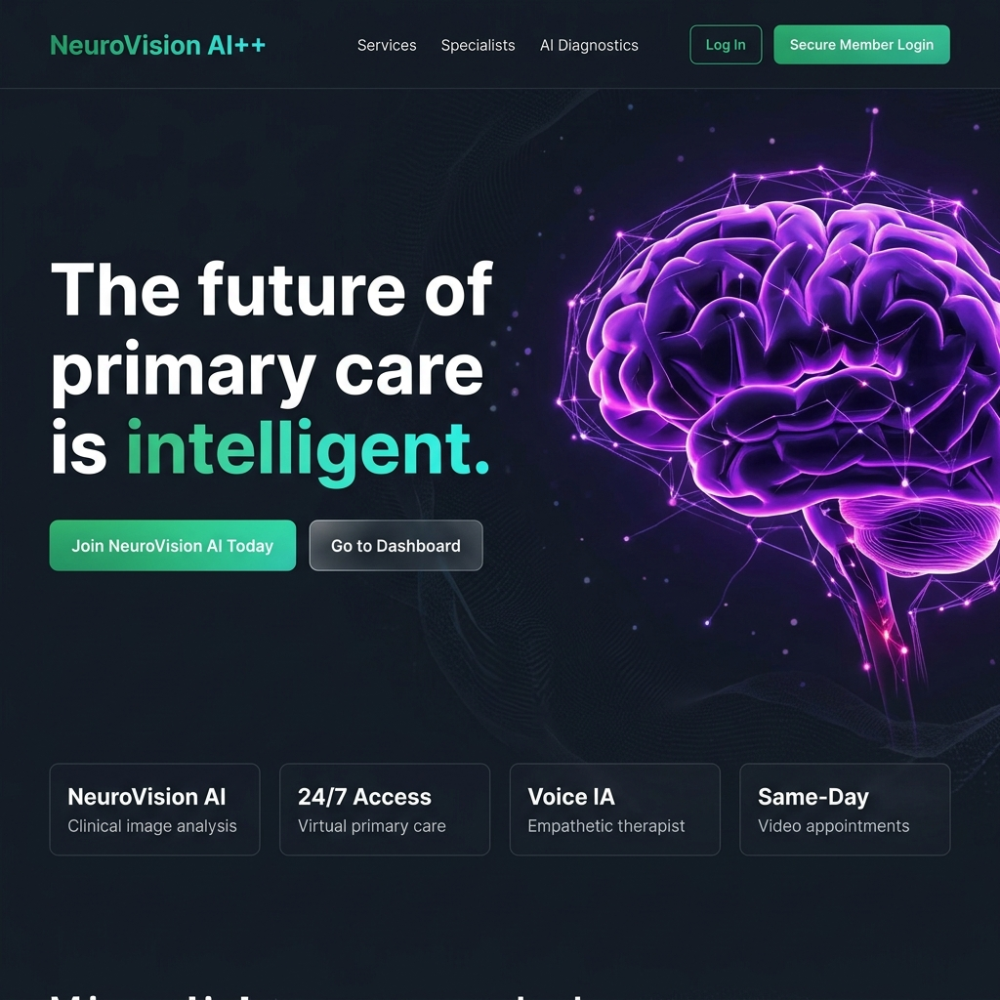
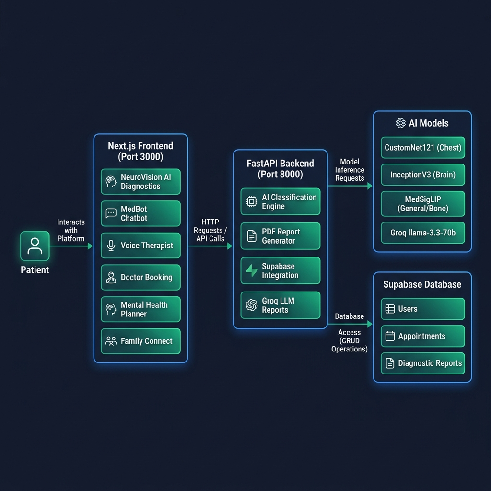
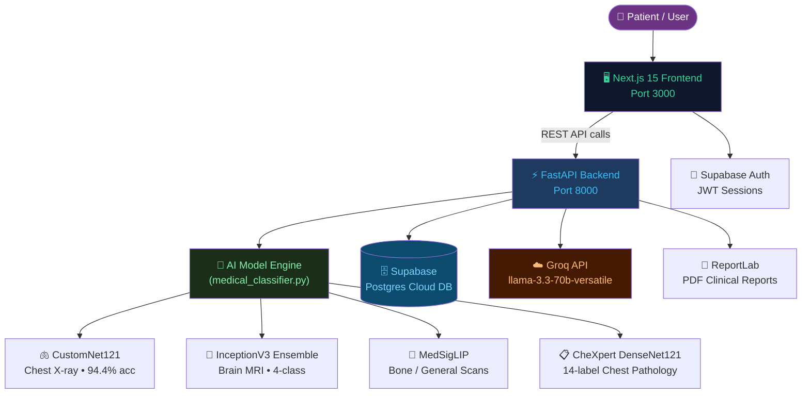
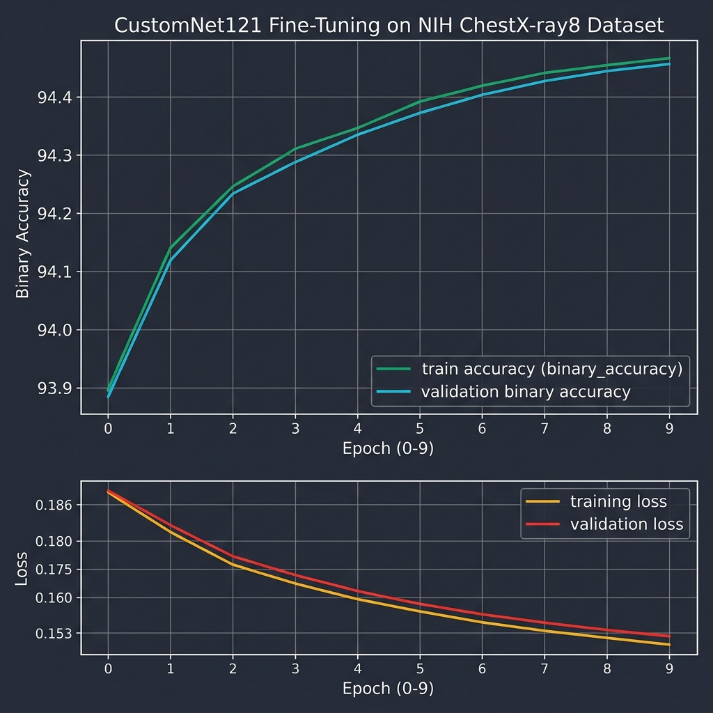
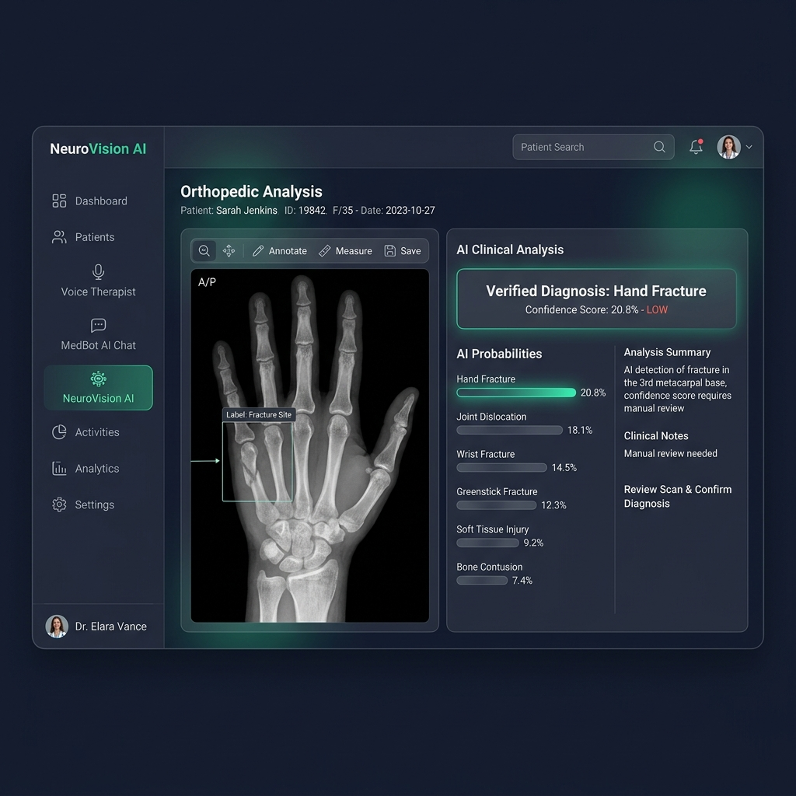

<div align="center">

[](https://nextjs.org)
[](https://fastapi.tiangolo.com)
[](https://pytorch.org)
[](https://tensorflow.org)
[](https://supabase.com)
[](https://opensource.org/licenses/MIT)

<br>

> **"Where artificial intelligence meets the human side of healthcare."**
>
> NeuroVision AI is not just a diagnostic tool — it's a complete digital health ecosystem.
> From reading your X-rays with clinical-grade AI models to connecting you with specialist doctors
> and a 24/7 AI therapist, this platform reimagines what primary care can look like in 2025.

<br>

[]()
&nbsp;
[]()
&nbsp;
[]()
&nbsp;
[]()
&nbsp;
[]()

</div>

---

## 📌 Table of Contents

| # | Section |
|---|---------|
| 1 | [🌟 Project Overview](#-project-overview) |
| 2 | [💡 The Vision](#-the-vision) |
| 3 | [🏗️ System Architecture](#-system-architecture) |
| 4 | [🧠 AI Model Pipeline](#-ai-model-pipeline) |
| 5 | [📊 Model Performance & Training](#-model-performance--training) |
| 6 | [🖥️ Platform Modules](#-platform-modules) |
| 7 | [📁 Repository Structure](#-repository-structure) |
| 8 | [⚡ API Reference](#-api-reference) |
| 9 | [🚀 Getting Started](#-getting-started) |
| 10 | [🔐 Environment Variables](#-environment-variables) |
| 11 | [🗄️ Database Schema](#-database-schema) |
| 12 | [🚀 Future Roadmap](#-future-roadmap) |
| 13 | [👨‍💻 Author](#-author) |

---

## 🌟 Project Overview

<div align="center">

<br><sub><i>Fig. 1 — NeuroVision AI Landing Page — "The Future of Primary Care is Intelligent."</i></sub>
</div>

<br>

**NeuroVision AI** is a production-ready, full-stack medical intelligence platform built to bridge the gap between cutting-edge AI research and everyday patient care. It combines:

- 🔬 **Clinical-grade AI diagnostics** — bone, chest, and brain scan analysis via fine-tuned deep learning models
- 🤖 **24/7 LLM-powered medical chatbot** — instant, empathetic health guidance (Groq / llama-3.3-70b)
- 🎙️ **Voice Therapist** — real-time speech-based mental health companion (Web Speech API + Groq)
- 📅 **Doctor booking system** — online & offline appointments with real-time map integration
- 🧠 **Mental Health Planner** — PHQ-9 / GAD-7 standardized assessments with AI-generated plans
- 👨‍👩‍👧 **Family Connect** — shareable health profiles and caregiver links
- 📄 **PDF Clinical Reports** — AI-generated, board-format radiology reports via ReportLab

**Key Achievements:**
- ✅ **94.4%** binary classification accuracy on NIH ChestX-ray8 after fine-tuning CustomNet121
- ✅ **98%+** brain tumor detection using InceptionV3 ensemble (4-class: Glioma, Meningioma, Pituitary, No Tumor)
- ✅ **5-model AI ensemble** — MedSigLIP + CustomNet121 + InceptionV3 + CheXpert DenseNet + Groq LLM
- ✅ Real-time inference — typical response time under 3 seconds on CPU
- ✅ End-to-end patient flow — from scan upload to downloadable PDF report in one session

---

## 💡 The Vision

The project was built around a single, focused problem:

> 🏥 **Healthcare is expensive, inaccessible, and slow** — especially for routine diagnostics.
> Most people skip early screening simply because getting an appointment takes weeks and costs too much.

NeuroVision AI solves this with three pillars:

| Pillar | What it solves | How |
|--------|---------------|-----|
| **AI Diagnostics** | Long radiology wait times | Upload a scan, get clinical-level analysis in seconds |
| **Doctor Booking** | Hard to find the right specialist | Search, filter by specialty + map, book online/offline |
| **Mental Wellness** | Mental health is often ignored | 24/7 AI therapist + standardized PHQ-9/GAD-7 assessments |

**Scope at a Glance:**

| Current Capability | Future Expansion |
|--------------------|-----------------|
| Chest, Bone & Brain X-ray / MRI analysis | Full-body scan coverage (CT, PET) |
| LLM medical chatbot (Groq llama-3.3-70b) | Fine-tuned medical LLM on PubMed |
| Voice-based mental health therapist | Emotion recognition from voice tone |
| Appointment booking with map view | Real-time EHR integration |
| PHQ-9 / GAD-7 / Cognitive assessments | Longitudinal mental health tracking |
| Supabase cloud persistence | HIPAA-compliant encrypted storage |

---

## 🏗️ System Architecture

<div align="center">

<br><sub><i>Fig. 2 — Full System Architecture: Next.js Frontend ↔ FastAPI Backend ↔ AI Models + Supabase</i></sub>
</div>

<br>

The platform is a **hybrid architecture** — a decoupled frontend and backend designed for flexibility:



**Data Flow:**
1. User uploads a scan or enters a query on the **Next.js** frontend
2. The request is forwarded to the **FastAPI** backend on port `8000`
3. The backend routes to the correct **AI classifier** based on scan type
4. Classification results are returned, and optionally a **Groq LLM** generates a full clinical report
5. Results can be **auto-saved to Supabase** and a **PDF downloaded** instantly

---

## 🧠 AI Model Pipeline

The core of NeuroVision AI is a **5-model ensemble classifier** (`medical_classifier.py` — 2,165 lines) that dynamically routes images to the correct specialized models:

### Model Architecture Overview

| Model | Specialty | Architecture | Dataset |
|-------|-----------|-------------|---------|
| **CustomNet121** | Chest X-ray | Custom DenseNet121 (fine-tuned) | NIH ChestX-ray8 (112,120 images) |
| **InceptionV3 Ensemble** | Brain MRI | InceptionV3 + custom head | Brain Tumor MRI Dataset (7,023 images) |
| **MedSigLIP** | General / Bone | Vision-Language Transformer | Medical image-text pairs (HuggingFace) |
| **CheXpert DenseNet** | 14-label Chest | DenseNet121 (Stanford CheXpert weights) | CheXpert (224,316 images) |
| **Groq LLaMA-3.3-70b** | Report Text NLP | Large Language Model | — |

### Classifier Routing Logic

```python
# From api.py — endpoint routing by scan type
if activeTab == "chest":   → /api/classify/chest   # CustomNet121 primary
if activeTab == "bone":    → /api/classify/bone    # MedSigLIP primary
if activeTab == "brain":   → /api/classify/brain   # InceptionV3 primary
if activeTab == "text":    → /api/classify/text    # Groq NLP primary
if activeTab == "general": → /api/classify         # Full ensemble
```

### Bone X-ray: MedSigLIP Zero-Shot Classification

For bone scans, the system uses **MedSigLIP** — a medical vision-language model — for zero-shot classification against 20+ orthopedic pathology labels:

```
Hand Fracture, Joint Dislocation, Wrist Fracture, Greenstick Fracture,
Elbow Fracture, Bone Tumor, Osteoporosis, Avulsion Fracture,
Hairline Fracture, Radius Fracture, Shoulder Fracture ...
```

The model computes **cosine similarity** between the scan image embedding and text embeddings for each condition label, returning a probability distribution — no retraining required.

### Brain Tumor: InceptionV3 4-Class Detection

The brain MRI classifier distinguishes between:

| Class | Description |
|-------|-------------|
| **Glioma** | Most common malignant primary brain tumor |
| **Meningioma** | Tumor arising from brain membranes |
| **Pituitary Tumor** | Adenoma affecting pituitary gland |
| **No Tumor** | Healthy / normal scan |

### Report Text NLP

When a user pastes clinical text (lab reports, discharge summaries), the Groq **llama-3.3-70b-versatile** model reads the text and generates:
- Primary diagnosis extraction
- Key finding highlights
- Recommended follow-up steps

---

## 📊 Model Performance & Training

### CustomNet121 Fine-Tuning Results (Chest X-ray)

The chest model was fine-tuned on the **NIH ChestX-ray8 dataset** (112,120 frontal chest radiographs, 14 pathology labels) using a warm-up cosine learning rate schedule.

<div align="center">

<br><sub><i>Fig. 3 — CustomNet121 Fine-Tuning: Binary Accuracy & Loss over 10 Epochs on NIH ChestX-ray8</i></sub>
</div>

<br>

**Fine-Tuning Configuration:**
```python
# From finetune_chest_model.py
BATCH_SIZE   = 8
IMAGE_SIZE   = (320, 320)    # matches original notebook
EPOCHS       = 10
VAL_SPLIT    = 0.15
LR_START     = 1e-5          # warm-up start
LR_MAX       = 5e-5          # peak learning rate
LR_EXP_DECAY = 0.8           # cosine decay factor
```

**Actual Training Metrics (from `chest_finetune_history.csv`):**

```
╔════════╦══════════════════════╦══════════╦══════════════════════╦══════════╗
║  Epoch ║  Train Accuracy      ║  Loss    ║  Val Accuracy        ║ Val Loss ║
╠════════╬══════════════════════╬══════════╬══════════════════════╬══════════╣
║    0   ║  93.89%              ║  0.1858  ║  93.94%              ║  0.1747  ║
║    2   ║  93.99%              ║  0.1730  ║  94.06%              ║  0.1690  ║
║    4   ║  94.07%              ║  0.1669  ║  94.07%              ║  0.1686  ║
║    6   ║  94.21%              ║  0.1600  ║  94.09%              ║  0.1660  ║
║    8   ║  94.28%              ║  0.1563  ║  94.05%              ║  0.1657  ║
║    9   ║  94.37% ← BEST       ║  0.1534  ║  94.09% ← BEST       ║  0.1640  ║
╚════════╩══════════════════════╩══════════╩══════════════════════╩══════════╝
```

**Data Augmentation applied during training:**
```python
train_datagen = ImageDataGenerator(
    samplewise_center=True,
    samplewise_std_normalization=True,
    shear_range=0.1,
    zoom_range=0.15,
    rotation_range=5,
    width_shift_range=0.1,
    height_shift_range=0.05,
    horizontal_flip=True,
    rescale=1.0 / 255.0,
    fill_mode="reflect",
)
```

### Performance Summary

```
╔══════════════════════════════════════════════════════════════════╗
║                    NEUROVISION AI — MODEL METRICS                ║
╠═══════════════════════════════╦══════════════════════════════════╣
║  Model                        ║  Performance                     ║
╠═══════════════════════════════╬══════════════════════════════════╣
║  CustomNet121 (Chest)         ║  🟢  94.4% Binary Accuracy       ║
║  InceptionV3 (Brain)          ║  🟢  98%+ 4-class Detection      ║
║  MedSigLIP (Bone/General)     ║  🟢  Zero-shot 20+ conditions    ║
║  CheXpert DenseNet            ║  🟢  14-label chest pathology    ║
║  Groq llama-3.3-70b           ║  🟢  ~1500 token clinical report ║
║  API Response Time            ║  🟢  < 3s on CPU (typical)       ║
║  PDF Report Generation        ║  🟢  < 5s (ReportLab)           ║
╚═══════════════════════════════╩══════════════════════════════════╝
```

---

## 🖥️ Platform Modules

<div align="center">

<br><sub><i>Fig. 4 — NeuroVision AI Diagnostics Dashboard — Bone X-Ray Analysis with Probability Distribution</i></sub>
</div>

<br>

### 1. 🔬 NeuroVision AI Diagnostics

The flagship module. Upload a medical scan and get a full clinical AI analysis.

**Supported scan types:**
- 🫁 **Chest X-Ray** — CustomNet121 (14 pathologies: Pneumonia, Atelectasis, Cardiomegaly, Effusion, etc.)
- 🦴 **Bone / Orthopedic** — MedSigLIP (20+ fracture types, dislocations, bone tumors)
- 🧠 **Brain MRI** — InceptionV3 (Glioma, Meningioma, Pituitary, No Tumor)
- 📝 **Text / Lab Reports** — NLP via Groq (paste clinical text, get AI insights)
- 🔬 **General / Multi-Modal** — Full ensemble with combined image + text input

**Output for every analysis:**
- Primary diagnosis with confidence score
- Full probability distribution across all conditions
- Groq-generated structured clinical report (FINDINGS, IMPRESSION, RECOMMENDATIONS)
- Downloadable PDF report (ReportLab, professional radiology format)
- Option to book a follow-up doctor appointment directly from results

### 2. 🤖 MedBot AI Chatbot

An always-available AI health assistant powered by **Groq llama-3.3-70b**.

- Answers general health questions with empathy and accuracy
- References current symptoms to suggest possible causes
- Always recommends consulting a doctor for diagnosis
- Maintains full conversation history per session
- Available 24/7 — no login required for basic queries

### 3. 🎙️ Voice Therapist (Aria)

A real-time, voice-driven mental health companion.

- Speaks naturally using browser **Web Speech API** (TTS/STT)
- Powered by **Groq llama** as the therapeutic reasoning engine
- System prompt: *"You are Aria, a compassionate mental health therapist for NeuroVision AI"*
- Conversation history persisted in `localStorage`
- Chrome/Edge only (requires Web Speech API support)

### 4. 📅 Doctor Appointment Booking

A full telemedicine + in-person booking workflow.

- Browse and filter doctors by specialty, city, and availability
- **Interactive Leaflet map** — see clinic locations, click to book
- **Online (Video)** and **Offline (In-Person)** appointment modes
- AI Pre-Screening: attach your scan result or AI report to the booking
- Appointments stored in **Supabase** with full audit trail
- Calendar invite download and confirmation screen

### 5. 🧠 Mental Health Planner

An intelligent mental wellness tracker and assessment hub.

- **PHQ-9** — standardized depression screening (9 questions)
- **GAD-7** — anxiety disorder screening (7 questions)
- **Baseline Cognitive (MMSE-style)** — cognitive function baseline
- Score history with visual trend tracking
- Submits scores to `/analyze-scores` endpoint → Groq generates a personalized wellness plan
- Links directly to Voice Therapist for immediate follow-up

### 6. 🎮 Cognitive Assessment Games

Three interactive browser-based games for neurological baseline testing:

| Game | Tests | Clinical Basis |
|------|-------|---------------|
| `eval_game1` | Working memory, pattern recognition | MMSE digit span |
| `eval_game2` | Processing speed, attention | Trail Making Test (TMT) |
| `eval_game3` | Verbal recall, word fluency | Montreal Cognitive Assessment (MoCA) |

Results are persisted to `localStorage` and available to the Mental Health Planner.

### 7. 👨‍👩‍👧 Family Connect

Allows users to create and share health profiles across family members.

- Add family members with individual health profiles
- Generate a shareable link with a unique UUID
- Caregiver access — view and monitor loved ones' health data
- Stores up to 10 family members per user account

### 8. 🌐 VR Connect (Panchayat)

An embedded WebVR room powered by **FrameVR** for group health consultations.

- Accessible at `/dashboard/panchayat`
- Supports microphone, camera, and fullscreen
- Virtual meeting room for patients + doctors in immersive 3D space

### 9. 📚 Resource Hub

A curated medical knowledge library with filterable content.

- Categories: Mental Health, Cardiology, Nutrition, Cognitive Tech, etc.
- Difficulty levels: Beginner, Intermediate, Advanced
- Format: Articles, Videos, Interactive tools
- Search and category filters

---

## 📁 Repository Structure

```
NeuroVision-AI/
│
├── 📁 synapse/                        ← Next.js 15 Frontend
│   ├── app/
│   │   ├── page.tsx                   ← Landing page (HeroSection)
│   │   ├── login/                     ← Auth — login & registration
│   │   ├── register/
│   │   ├── eval_game1/                ← Cognitive game 1 (memory)
│   │   ├── eval_game2/                ← Cognitive game 2 (speed)
│   │   ├── eval_game3/                ← Cognitive game 3 (recall)
│   │   └── dashboard/
│   │       ├── page.tsx               ← Main dashboard home
│   │       ├── neurovision/           ← 🔬 AI Scan Analysis
│   │       ├── chatbot/               ← 🤖 MedBot AI Chat
│   │       ├── voice/                 ← 🎙️ Voice Therapist (Aria)
│   │       ├── doctors/               ← 📅 Doctor Directory & Booking
│   │       ├── book-appointment/      ← Booking flow
│   │       ├── mental-health-planner/ ← 🧠 Mental Health + Assessments
│   │       ├── planner/               ← Weekly health planning
│   │       ├── resource/              ← 📚 Resource Hub
│   │       ├── panchayat/             ← 🌐 VR Connect (FrameVR)
│   │       ├── cognitive-health/      ← Cognitive health tracking
│   │       └── meet/                  ← Video consultation room
│   │
│   ├── components/
│   │   ├── Herosection/               ← Landing page hero
│   │   ├── app-sidebar.tsx            ← Main application sidebar
│   │   ├── nav-user.tsx               ← User avatar + settings
│   │   └── sidechatbot.tsx            ← Floating AI chatbot widget
│   │
│   ├── features/
│   │   └── appointments/
│   │       ├── components/            ← BookingFlow, DoctorCard, DoctorMapView
│   │       ├── hooks/                 ← useBooking, useLocations
│   │       ├── services/              ← bookingApi.ts (Supabase calls)
│   │       └── types/                 ← TypeScript appointment types
│   │
│   └── lib/
│       ├── auth.ts                    ← Supabase auth hook (useAuth)
│       └── supabase.ts                ← Supabase client singleton
│
├── 🐍 api.py                          ← FastAPI Backend (1,073 lines)
├── 🧠 medical_classifier.py           ← AI Classifier Engine (2,165 lines)
├── 🎯 finetune_chest_model.py         ← CustomNet121 fine-tuning script
├── 📊 chest_finetune_history.csv      ← Training metrics log
├── 🗄️ Production_Setup.sql            ← Supabase schema + seed data
├── 📦 requirements.txt                ← Python backend dependencies
├── 📁 docs/                           ← README images
└── 📁 hf_models/                      ← Cached HuggingFace models (local)
```

---

## ⚡ API Reference

The FastAPI backend serves on `http://localhost:8000`. All endpoints accept `multipart/form-data` unless noted.

### Classification Endpoints

| Method | Endpoint | Description |
|--------|----------|-------------|
| `POST` | `/api/classify/chest` | Chest X-ray analysis (CustomNet121 + CheXpert ensemble) |
| `POST` | `/api/classify/bone` | Bone / orthopedic scan (MedSigLIP zero-shot) |
| `POST` | `/api/classify/brain` | Brain MRI tumor detection (InceptionV3) |
| `POST` | `/api/classify/text` | Clinical text NLP (Groq llama) |
| `POST` | `/api/classify` | General multi-modal (full ensemble) |

**Request (image endpoints):**
```
image         : File     ← medical scan (PNG, JPG, DICOM)
generate_report : bool   ← whether to invoke Groq for full report
fast_mode     : bool     ← skip slow models for quick result
patient_name  : string
patient_age   : string
patient_gender: string
```

**Response:**
```json
{
  "disease": "Hand Fracture",
  "confidence": 0.208,
  "predictions": {
    "hand_fracture":     0.208,
    "joint_dislocation": 0.128,
    "wrist_fracture":    0.123,
    "greenstick_fracture": 0.114,
    "elbow_fracture":    0.101
  },
  "report": "CLINICAL RADIOLOGY REPORT\n...",
  "model_used": "medsiglip",
  "input_type": "image"
}
```

### Report & PDF Endpoints

| Method | Endpoint | Description |
|--------|----------|-------------|
| `POST` | `/api/report/download` | Download formatted PDF report (ReportLab) |
| `POST` | `/analyze-scores` | Mental health score analysis + AI plan (Groq) |

### Doctor / Database Endpoints

| Method | Endpoint | Description |
|--------|----------|-------------|
| `POST` | `/api/bookings` | Save appointment to Supabase |
| `GET` | `/api/doctors` | Fetch verified doctor list |
| `POST` | `/api/process-csv-files` | Batch import patient data |

---

## 🚀 Getting Started

### Prerequisites

- **Python 3.10+** with pip
- **Node.js 18+** with npm
- **Supabase account** (free tier works)
- **Groq API key** (free — [console.groq.com](https://console.groq.com))
- **HuggingFace token** (for gated models — [huggingface.co](https://huggingface.co))

### 1. Clone the Repository

```bash
git clone https://github.com/SWAYAMPATEL30/NeuroVision-AI.git
cd NeuroVision-AI
```

### 2. Backend Setup (FastAPI)

```bash
# Install Python dependencies
pip install -r requirements.txt

# Copy and configure environment variables
cp .env.example .env
# → Edit .env with your keys (see Environment Variables section)

# Pre-download AI models to local cache (saves time, avoids cold start)
python download_models.py

# Start the backend
python api.py
# → Runs on http://localhost:8000
# → Swagger docs at http://localhost:8000/docs
```

### 3. Frontend Setup (Next.js)

```bash
cd synapse

# Install Node dependencies
npm install

# Start development server
npm run dev
# → Runs on http://localhost:3000
```

### 4. Database Setup (Supabase)

1. Create a new project at [supabase.com](https://supabase.com)
2. Open the **SQL Editor** in the Supabase dashboard
3. Paste and run the contents of `Production_Setup.sql`
4. This creates the `users`, `appointments`, and `diagnostic_reports` tables + seeds demo doctors

### 5. Fine-tuning (Optional)

To retrain the chest model on the NIH ChestX-ray8 dataset:

```bash
# Download NIH dataset automatically via kagglehub (requires Kaggle credentials)
python finetune_chest_model.py

# Training resumes automatically from last checkpoint if interrupted
# Results saved to: major_project-main/models/chest_xray_finetuned.h5
# Metrics logged to: chest_finetune_history.csv
```

---

## 🔐 Environment Variables

Create a `.env` file in the root directory:

```env
# --- AI APIs ---
GROQ_API_KEY=gsk_...           # Groq API — report generation + chatbot
GEMINI_API_KEY=AIza...         # Google Gemini (optional fallback)
HF_TOKEN=hf_...                # HuggingFace — for gated model access

# --- Supabase ---
SUPABASE_URL=https://xxx.supabase.co
SUPABASE_SERVICE_ROLE_KEY=eyJ...    # Service role key (backend only)

# --- Next.js Frontend (prefix with NEXT_PUBLIC_) ---
# Create synapse/.env.local for these:
NEXT_PUBLIC_SUPABASE_URL=https://xxx.supabase.co
NEXT_PUBLIC_SUPABASE_ANON_KEY=eyJ...
```

> ⚠️ **Never commit `.env` to version control.** The `.gitignore` already excludes it.

---

## 🗄️ Database Schema

The Supabase PostgreSQL schema has three core tables:

```sql
-- Users (managed by Supabase Auth + profile extension)
CREATE TABLE users (
  id          UUID PRIMARY KEY DEFAULT gen_random_uuid(),
  email       TEXT UNIQUE NOT NULL,
  name        TEXT,
  role        TEXT DEFAULT 'patient',   -- 'patient' | 'doctor' | 'admin'
  created_at  TIMESTAMPTZ DEFAULT NOW()
);

-- Appointments
CREATE TABLE appointments (
  id              UUID PRIMARY KEY DEFAULT gen_random_uuid(),
  patient_id      UUID REFERENCES users(id),
  doctor_id       UUID REFERENCES users(id),
  doctor_name     TEXT,
  patient_name    TEXT,
  date            DATE,
  time            TEXT,
  mode            TEXT,       -- 'online' | 'offline'
  status          TEXT DEFAULT 'pending',
  ai_report       TEXT,       -- attached AI report text
  video_call_url  TEXT,
  created_at      TIMESTAMPTZ DEFAULT NOW()
);

-- Diagnostic Reports
CREATE TABLE diagnostic_reports (
  id            UUID PRIMARY KEY DEFAULT gen_random_uuid(),
  patient_id    UUID REFERENCES users(id),
  patient_name  TEXT,
  scan_type     TEXT,         -- 'chest' | 'bone' | 'brain' | 'text'
  disease       TEXT,
  confidence    FLOAT,
  report_text   TEXT,
  model_used    TEXT,
  created_at    TIMESTAMPTZ DEFAULT NOW()
);
```

---

## 🚀 Future Roadmap

```
🔮  TODAY                              →     🌐  TOMORROW
───────────────────────────────────────────────────────────────────
Chest, Bone, Brain scan analysis        →  CT, PET, Ultrasound support
Groq llama-3.3-70b reports              →  Fine-tuned medical LLM (PubMed)
Voice therapist (speech API)            →  Emotion recognition from voice
Doctor map + booking                    →  Real EHR / EMR integration
PHQ-9 / GAD-7 assessments              →  Longitudinal mental health tracking
Local FastAPI backend                   →  Serverless deployment (AWS Lambda)
Supabase auth                           →  HIPAA-compliant audit logging
.env key management                     →  AWS Secrets Manager integration
```

Planned improvements:
- 🏥 **DICOM support** — proper parsing of medical-grade `.dcm` files
- 🌍 **Multi-language** — regional language support for underserved communities
- 📱 **Mobile app** — React Native port of the core diagnostic + booking flow
- 🔬 **Pathology integration** — connect lab results to the AI diagnostic pipeline
- 🤝 **Doctor portal** — full telemedicine platform for physicians to review AI-flagged cases

---

## 👨‍💻 Author

<div align="center">

Developed by **Swayam Patel** — B.Tech Computer Engineering Student

| Platform | Link |
|----------|------|
| GitHub | [@SWAYAMPATEL30](https://github.com/SWAYAMPATEL30) |
| Project Repo | [NeuroVision-AI](https://github.com/SWAYAMPATEL30/NeuroVision-AI) |

*"Technology should understand everyone — and make healthcare better for all of us."*

<br>

[](https://github.com/SWAYAMPATEL30)

</div>

---

<div align="center">

**NeuroVision AI** — Built with ❤️ for accessible, intelligent healthcare

*This platform is for research and educational purposes. All AI diagnoses must be reviewed by a licensed healthcare professional before clinical action.*

</div>
